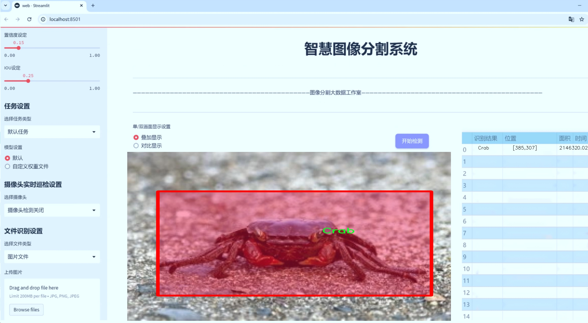
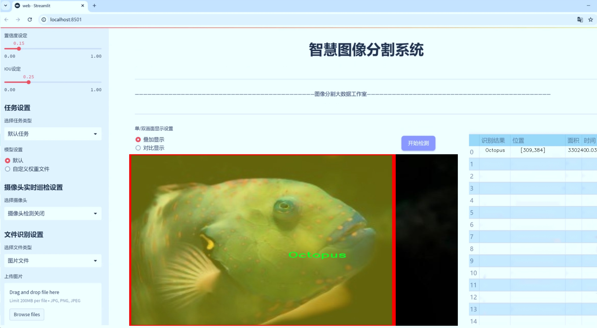
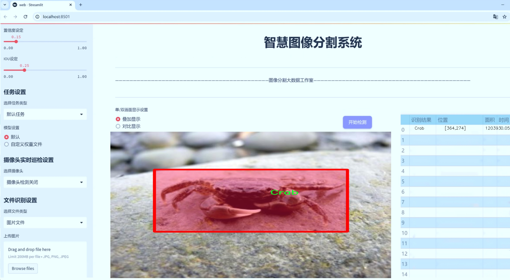
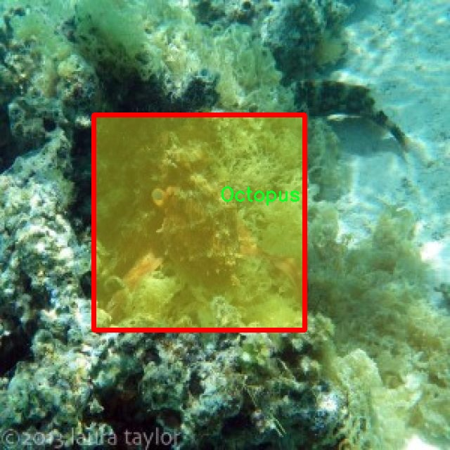
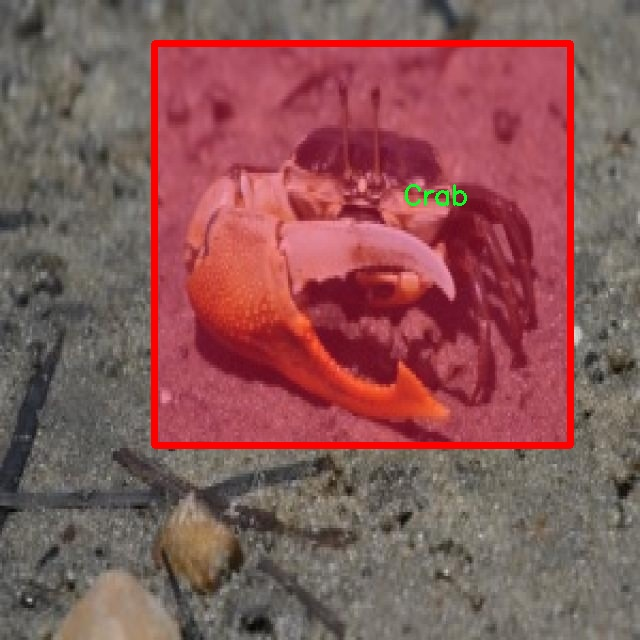
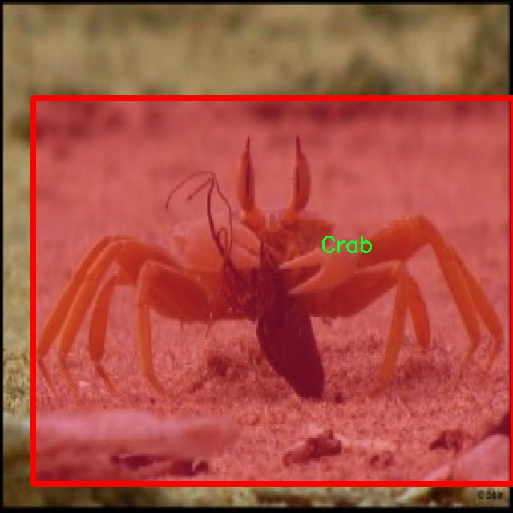
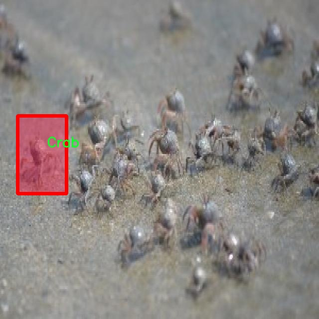
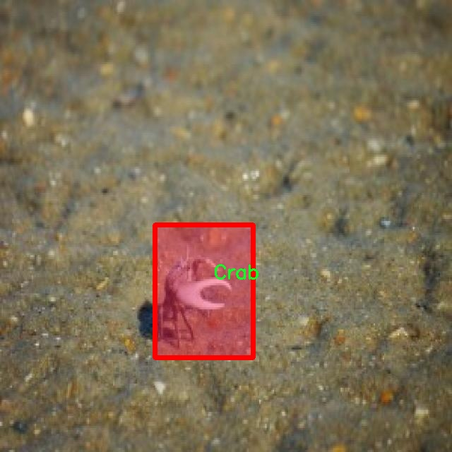

# 海洋生物图像分割系统源码＆数据集分享
 [yolov8-seg-C2f-DiverseBranchBlock＆yolov8-seg-C2f-Faster-EMA等50+全套改进创新点发刊_一键训练教程_Web前端展示]

### 1.研究背景与意义

项目参考[ILSVRC ImageNet Large Scale Visual Recognition Challenge](https://gitee.com/YOLOv8_YOLOv11_Segmentation_Studio/projects)

项目来源[AAAI Global Al lnnovation Contest](https://kdocs.cn/l/cszuIiCKVNis)

研究背景与意义

随着全球海洋生态环境的日益恶化，海洋生物的保护与管理显得尤为重要。海洋生物不仅是生态系统的重要组成部分，也是人类生存和发展的重要资源。近年来，随着深海探测技术的进步和图像处理技术的发展，海洋生物的监测与研究逐渐向数字化、智能化方向发展。在这一背景下，基于计算机视觉的海洋生物图像分割技术应运而生，成为海洋生物研究的重要工具之一。

本研究旨在基于改进的YOLOv8模型，构建一个高效的海洋生物图像分割系统。YOLO（You Only Look Once）系列模型以其高效的实时检测能力和较高的准确率在目标检测领域取得了显著的成果。然而，传统的YOLO模型在处理复杂背景和多类别目标时，仍然存在一定的局限性。通过对YOLOv8模型进行改进，我们希望能够提高其在海洋生物图像分割任务中的表现，尤其是在对不同类别海洋生物的精确识别和分割上。

本研究所使用的数据集包含3100幅图像，涵盖了四类海洋生物：螃蟹、鱼类、章鱼和海龟。这些类别的选择不仅具有代表性，而且在生态系统中扮演着重要角色。螃蟹和鱼类是海洋食物链的基础，而章鱼和海龟则是海洋生态系统中的关键物种。通过对这些生物的有效监测与分析，可以为海洋保护和资源管理提供科学依据。

海洋生物图像分割的研究意义在于，它不仅可以提高对海洋生物多样性的认识，还能够为生态环境保护提供数据支持。通过对海洋生物的实时监测，研究人员可以及时发现生态环境的变化，进而采取相应的保护措施。此外，海洋生物的分布与数量变化也与气候变化、污染等因素密切相关，利用图像分割技术可以帮助科学家更好地理解这些因素对海洋生态的影响。

在技术层面，改进YOLOv8模型的应用将推动海洋生物图像处理技术的发展。通过引入深度学习中的先进算法和技术，我们可以提升模型在复杂场景下的鲁棒性和准确性。这不仅有助于提升海洋生物监测的效率，也为相关领域的研究提供了新的思路和方法。

综上所述，基于改进YOLOv8的海洋生物图像分割系统的研究，不仅具有重要的理论意义和实践价值，还将为海洋生态保护和可持续发展提供有力支持。通过这一研究，我们期望能够为海洋生物的监测与保护贡献一份力量，同时推动计算机视觉技术在生态研究中的应用与发展。

### 2.图片演示







##### 注意：由于此博客编辑较早，上面“2.图片演示”和“3.视频演示”展示的系统图片或者视频可能为老版本，新版本在老版本的基础上升级如下：（实际效果以升级的新版本为准）

  （1）适配了YOLOV8的“目标检测”模型和“实例分割”模型，通过加载相应的权重（.pt）文件即可自适应加载模型。

  （2）支持“图片识别”、“视频识别”、“摄像头实时识别”三种识别模式。

  （3）支持“图片识别”、“视频识别”、“摄像头实时识别”三种识别结果保存导出，解决手动导出（容易卡顿出现爆内存）存在的问题，识别完自动保存结果并导出到tempDir中。

  （4）支持Web前端系统中的标题、背景图等自定义修改，后面提供修改教程。

  另外本项目提供训练的数据集和训练教程,暂不提供权重文件（best.pt）,需要您按照教程进行训练后实现图片演示和Web前端界面演示的效果。

### 3.视频演示

[3.1 视频演示](https://www.bilibili.com/video/BV1mX1aYdESR/)

### 4.数据集信息展示

##### 4.1 本项目数据集详细数据（类别数＆类别名）

nc: 4
names: ['Crab', 'Fishes', 'Octopus', 'Turtle']


##### 4.2 本项目数据集信息介绍

数据集信息展示

在本研究中，我们使用了名为“fish detection”的数据集，以支持改进YOLOv8-seg的海洋生物图像分割系统的训练和评估。该数据集专注于海洋生物的多样性，包含四个主要类别，分别是螃蟹（Crab）、鱼类（Fishes）、章鱼（Octopus）和海龟（Turtle）。这些类别的选择不仅反映了海洋生态系统的丰富性，也为模型的训练提供了多样化的样本，使其能够更好地适应不同的海洋生物图像分割任务。

数据集的构建过程涉及从多个海洋环境中收集图像，确保每个类别的样本数量和质量都能满足深度学习模型的训练需求。每个类别的图像均经过精心挑选和标注，以确保其在特征上具有代表性。螃蟹的图像展示了其独特的外形和颜色变化，鱼类的图像则涵盖了不同种类和体型的样本，章鱼的图像展示了其复杂的形态和伪装能力，而海龟的图像则突出了其在水中游动的优雅姿态。这些图像不仅为模型提供了丰富的视觉信息，也为后续的图像分割任务奠定了坚实的基础。

在数据集的标注过程中，采用了高精度的分割标注技术，确保每个海洋生物的轮廓和特征都被准确地捕捉。这种细致的标注方式使得YOLOv8-seg能够在训练过程中学习到更为细致的特征，从而提升其在实际应用中的分割精度。此外，数据集还考虑到了不同光照条件和水下环境的变化，使得模型在多样化的海洋环境中具有更强的适应能力。

为了增强模型的泛化能力，数据集还进行了数据增强处理，包括旋转、缩放、翻转等操作。这些增强手段不仅增加了训练样本的多样性，还帮助模型更好地学习到海洋生物在不同姿态和角度下的特征。这一过程对于提高模型在真实场景中的表现至关重要，因为海洋生物的外观和位置可能因环境变化而有所不同。

在训练过程中，我们将数据集分为训练集和验证集，以便对模型的性能进行有效评估。训练集用于模型的学习，而验证集则用于监测模型在未见数据上的表现，从而避免过拟合现象的发生。通过这种方式，我们能够确保模型在实际应用中具备良好的鲁棒性和准确性。

综上所述，“fish detection”数据集为改进YOLOv8-seg的海洋生物图像分割系统提供了丰富的样本和高质量的标注，涵盖了四个主要类别的海洋生物。通过对数据集的精心设计和处理，我们期望能够提升模型在海洋生物图像分割任务中的表现，为海洋生态保护和研究提供更为精准的技术支持。











### 5.全套项目环境部署视频教程（零基础手把手教学）

[5.1 环境部署教程链接（零基础手把手教学）](https://www.bilibili.com/video/BV1jG4Ve4E9t/?vd_source=bc9aec86d164b67a7004b996143742dc)


[5.2 安装Python虚拟环境创建和依赖库安装视频教程链接（零基础手把手教学）](https://www.bilibili.com/video/BV1nA4VeYEze/?vd_source=bc9aec86d164b67a7004b996143742dc)

### 6.手把手YOLOV8-seg训练视频教程（零基础小白有手就能学会）

[6.1 手把手YOLOV8-seg训练视频教程（零基础小白有手就能学会）](https://www.bilibili.com/video/BV1cA4VeYETe/?vd_source=bc9aec86d164b67a7004b996143742dc)


按照上面的训练视频教程链接加载项目提供的数据集，运行train.py即可开始训练



     Epoch   gpu_mem       box       obj       cls    labels  img_size
     1/200     0G   0.01576   0.01955  0.007536        22      1280: 100%|██████████| 849/849 [14:42<00:00,  1.04s/it]
               Class     Images     Labels          P          R     mAP@.5 mAP@.5:.95: 100%|██████████| 213/213 [01:14<00:00,  2.87it/s]
                 all       3395      17314      0.994      0.957      0.0957      0.0843

     Epoch   gpu_mem       box       obj       cls    labels  img_size
     2/200     0G   0.01578   0.01923  0.007006        22      1280: 100%|██████████| 849/849 [14:44<00:00,  1.04s/it]
               Class     Images     Labels          P          R     mAP@.5 mAP@.5:.95: 100%|██████████| 213/213 [01:12<00:00,  2.95it/s]
                 all       3395      17314      0.996      0.956      0.0957      0.0845

     Epoch   gpu_mem       box       obj       cls    labels  img_size
     3/200     0G   0.01561    0.0191  0.006895        27      1280: 100%|██████████| 849/849 [10:56<00:00,  1.29it/s]
               Class     Images     Labels          P          R     mAP@.5 mAP@.5:.95: 100%|███████   | 187/213 [00:52<00:00,  4.04it/s]
                 all       3395      17314      0.996      0.957      0.0957      0.0845


### 7.50+种全套YOLOV8-seg创新点代码加载调参视频教程（一键加载写好的改进模型的配置文件）

[7.1 50+种全套YOLOV8-seg创新点代码加载调参视频教程（一键加载写好的改进模型的配置文件）](https://www.bilibili.com/video/BV1Hw4VePEXv/?vd_source=bc9aec86d164b67a7004b996143742dc)

### 8.YOLOV8-seg图像分割算法原理

原始YOLOv8-seg算法原理

YOLOv8-seg算法是YOLO系列中的最新版本，继承并扩展了以往YOLO模型的优良特性，尤其在目标检测和图像分割任务中表现出色。自2015年YOLO模型首次提出以来，经过多个版本的迭代，YOLOv8在推理速度、精度、易用性和硬件兼容性等方面都实现了显著的提升。这些进步使得YOLOv8成为当前业界最受欢迎和成功的模型之一，尤其是在处理复杂的视觉任务时，其表现尤为突出。

YOLOv8的网络结构主要由三部分组成：Backbone（骨干网络）、Neck（颈部结构）和Head（头部结构）。Backbone负责特征提取，Neck则用于特征融合，而Head则实现了目标检测和分割信息的输出。YOLOv8的设计理念是通过高效的特征提取和融合机制，提升模型在不同任务中的表现。

在Backbone部分，YOLOv8引入了C2F模块，这一模块是对YOLOv5中C3模块的改进，结合了YOLOv7中的ELAN模块设计思想。C2F模块通过增加并行的梯度流分支，确保在轻量化的基础上获得更丰富的梯度信息，从而提高了模型的精度和效率。这种结构的设计使得YOLOv8能够在较小的模型尺寸下，依然保持较高的特征提取能力。

Neck部分的设计同样具有创新性，YOLOv8在这一部分去除了传统的上采样卷积结构，直接对Backbone不同阶段输出的特征进行上采样。这种简化的结构不仅减少了计算复杂度，还提升了特征融合的效率，使得模型在处理多尺度目标时更加灵活。

在Head部分，YOLOv8采用了解耦合头结构，将目标检测和分类任务分开处理。这一设计的优势在于能够独立优化每个任务的损失函数，进而提高整体性能。YOLOv8不再使用传统的Anchor-Based方法，而是转向Anchor-Free的策略，将目标检测转化为关键点检测。这一转变使得模型在面对不同尺度和形状的目标时，具有更强的适应性和泛化能力。

在训练过程中，YOLOv8还引入了动态样本分配策略，优化了数据增强方法，特别是在最后的训练阶段关闭了马赛克增强。这种方法使得模型能够更好地适应实际应用场景，减少了训练过程中的噪声干扰，提高了模型的鲁棒性。

YOLOv8-seg算法在损失函数的设计上也进行了创新，采用了BCELoss作为分类损失，DFLLoss和CIoULoss作为回归损失。这种多损失函数的组合使得模型在训练过程中能够更快速地聚焦于目标区域，提高了检测精度。

通过以上设计，YOLOv8-seg算法在目标检测和图像分割任务中展现出了卓越的性能。其高效的特征提取、灵活的特征融合以及独立的任务处理机制，使得YOLOv8-seg能够在多种应用场景中取得良好的效果，尤其是在需要实时处理的任务中，YOLOv8-seg更是展现出了其无与伦比的优势。

综上所述，YOLOv8-seg算法不仅在结构上进行了优化，还在训练策略和损失函数设计上进行了创新，极大地提升了模型的性能和适用性。这些进步使得YOLOv8-seg成为当前目标检测和图像分割领域的一个重要里程碑，展现了YOLO系列算法在计算机视觉任务中的强大潜力。随着YOLOv8-seg的不断发展和应用，未来在更多复杂场景下的表现值得期待。


### 9.系统功能展示（检测对象为举例，实际内容以本项目数据集为准）

图9.1.系统支持检测结果表格显示

  图9.2.系统支持置信度和IOU阈值手动调节

  图9.3.系统支持自定义加载权重文件best.pt(需要你通过步骤5中训练获得)

  图9.4.系统支持摄像头实时识别

  图9.5.系统支持图片识别

  图9.6.系统支持视频识别

  图9.7.系统支持识别结果文件自动保存

  图9.8.系统支持Excel导出检测结果数据


### 10.50+种全套YOLOV8-seg创新点原理讲解（非科班也可以轻松写刊发刊，V11版本正在科研待更新）

#### 10.1 由于篇幅限制，每个创新点的具体原理讲解就不一一展开，具体见下列网址中的创新点对应子项目的技术原理博客网址【Blog】：


[10.1 50+种全套YOLOV8-seg创新点原理讲解链接](https://gitee.com/qunmasj/good)

#### 10.2 部分改进模块原理讲解(完整的改进原理见上图和技术博客链接)【如果此小节的图加载失败可以通过CSDN或者Github搜索该博客的标题访问原始博客，原始博客图片显示正常】
### YOLOv8简介
#### Neck模块设计
骨干网络和 Neck 的具体变化为：

第一个卷积层的 kernel 从 6x6 变成了 3x3
所有的 C3 模块换成 C2f，结构如下所示，可以发现多了更多的跳层连接和额外的 Split 操作


去掉了 Neck 模块中的 2 个卷积连接层
Backbone 中 C2f 的 block 数从 3-6-9-3 改成了 3-6-6-3
查看 N/S/M/L/X 等不同大小模型，可以发现 N/S 和 L/X 两组模型只是改了缩放系数，但是 S/M/L 等骨干网络的通道数设置不一样，没有遵循同一套缩放系数。如此设计的原因应该是同一套缩放系数下的通道设置不是最优设计，YOLOv7 网络设计时也没有遵循一套缩放系数作用于所有模型。

#### Head模块设计
Head 部分变化最大，从原先的耦合头变成了解耦头，并且从 YOLOv5 的 Anchor-Based 变成了 Anchor-Free。其结构如下所示：


可以看出，不再有之前的 objectness 分支，只有解耦的分类和回归分支，并且其回归分支使用了 Distribution Focal Loss 中提出的积分形式表示法。

#### Loss 计算
Loss 计算过程包括 2 个部分： 正负样本分配策略和 Loss 计算。 现代目标检测器大部分都会在正负样本分配策略上面做文章，典型的如 YOLOX 的 simOTA、TOOD 的 TaskAlignedAssigner 和 RTMDet 的 DynamicSoftLabelAssigner，这类 Assigner 大都是动态分配策略，而 YOLOv5 采用的依然是静态分配策略。考虑到动态分配策略的优异性，YOLOv8 算法中则直接引用了 TOOD 的 TaskAlignedAssigner。 TaskAlignedAssigner 的匹配策略简单总结为： 根据分类与回归的分数加权的分数选择正样本。

s 是标注类别对应的预测分值，u 是预测框和 gt 框的 iou，两者相乘就可以衡量对齐程度。

对于每一个 GT，对所有的预测框基于 GT 类别对应分类分数，预测框与 GT 的 IoU 的加权得到一个关联分类以及回归的对齐分数 alignment_metrics 。
对于每一个 GT，直接基于 alignment_metrics 对齐分数选取 topK 大的作为正样本
Loss 计算包括 2 个分支： 分类和回归分支，没有了之前的 objectness 分支。
分类分支依然采用 BCE Loss
回归分支需要和 Distribution Focal Loss 中提出的积分形式表示法绑定，因此使用了 Distribution Focal Loss， 同时还使用了 CIoU Loss
Loss 采用一定权重比例加权即可。
#### 训练数据增强
数据增强方面和 YOLOv5 差距不大，只不过引入了 YOLOX 中提出的最后 10 个 epoch 关闭 Mosaic 的操作。假设训练 epoch 是 500，其示意图如下所示：

### RCS-OSA的基本原理
参考该博客，RCSOSA（RCS-One-Shot Aggregation）是RCS-YOLO中提出的一种结构，我们可以将主要原理概括如下：

1. RCS（Reparameterized Convolution based on channel Shuffle）: 结合了通道混洗，通过重参数化卷积来增强网络的特征提取能力。

2. RCS模块: 在训练阶段，利用多分支结构学习丰富的特征表示；在推理阶段，通过结构化重参数化简化为单一分支，减少内存消耗。

3. OSA（One-Shot Aggregation）: 一次性聚合多个特征级联，减少网络计算负担，提高计算效率。

4. 特征级联: RCS-OSA模块通过堆叠RCS，确保特征的复用并加强不同层之间的信息流动。

#### RCS
RCS（基于通道Shuffle的重参数化卷积）是RCS-YOLO的核心组成部分，旨在训练阶段通过多分支结构学习丰富的特征信息，并在推理阶段通过简化为单分支结构来减少内存消耗，实现快速推理。此外，RCS利用通道分割和通道Shuffle操作来降低计算复杂性，同时保持通道间的信息交换，这样在推理阶段相比普通的3×3卷积可以减少一半的计算复杂度。通过结构重参数化，RCS能够在训练阶段从输入特征中学习深层表示，并在推理阶段实现快速推理，同时减少内存消耗。

#### RCS模块
RCS（基于通道Shuffle的重参数化卷积）模块中，结构在训练阶段使用多个分支，包括1x1和3x3的卷积，以及一个直接的连接（Identity），用于学习丰富的特征表示。在推理阶段，结构被重参数化成一个单一的3x3卷积，以减少计算复杂性和内存消耗，同时保持训练阶段学到的特征表达能力。这与RCS的设计理念紧密相连，即在不牺牲性能的情况下提高计算效率。


上图为大家展示了RCS的结构，分为训练阶段（a部分）和推理阶段（b部分）。在训练阶段，输入通过通道分割，一部分输入经过RepVGG块，另一部分保持不变。然后通过1x1卷积和3x3卷积处理RepVGG块的输出，与另一部分输入进行通道Shuffle和连接。在推理阶段，原来的多分支结构被简化为一个单一的3x3 RepConv块。这种设计允许在训练时学习复杂特征，在推理时减少计算复杂度。黑色边框的矩形代表特定的模块操作，渐变色的矩形代表张量的特定特征，矩形的宽度代表张量的通道数。 

#### OSA
OSA（One-Shot Aggregation）是一个关键的模块，旨在提高网络在处理密集连接时的效率。OSA模块通过表示具有多个感受野的多样化特征，并在最后的特征映射中仅聚合一次所有特征，从而克服了DenseNet中密集连接的低效率问题。

OSA模块的使用有两个主要目的：

1. 提高特征表示的多样性：OSA通过聚合具有不同感受野的特征来增加网络对于不同尺度的敏感性，这有助于提升模型对不同大小目标的检测能力。

2. 提高效率：通过在网络的最后一部分只进行一次特征聚合，OSA减少了重复的特征计算和存储需求，从而提高了网络的计算和能源效率。

在RCS-YOLO中，OSA模块被进一步与RCS（基于通道Shuffle的重参数化卷积）相结合，形成RCS-OSA模块。这种结合不仅保持了低成本的内存消耗，而且还实现了语义信息的有效提取，对于构建轻量级和大规模的对象检测器尤为重要。

下面我将为大家展示RCS-OSA（One-Shot Aggregation of RCS）的结构。


在RCS-OSA模块中，输入被分为两部分，一部分直接通过，另一部分通过堆叠的RCS模块进行处理。处理后的特征和直接通过的特征在通道混洗（Channel Shuffle）后合并。这种结构设计用于增强模型的特征提取和利用效率，是RCS-YOLO架构中的一个关键组成部分旨在通过一次性聚合来提高模型处理特征的能力，同时保持计算效率。

#### 特征级联
特征级联（feature cascade）是一种技术，通过在网络的一次性聚合（one-shot aggregate）路径上维持有限数量的特征级联来实现的。在RCS-YOLO中，特别是在RCS-OSA（RCS-Based One-Shot Aggregation）模块中，只保留了三个特征级联。

特征级联的目的是为了减轻网络计算负担并降低内存占用。这种方法可以有效地聚合不同层次的特征，提高模型的语义信息提取能力，同时避免了过度复杂化网络结构所带来的低效率和高资源消耗。

下面为大家提供的图像展示的是RCS-YOLO的整体架构，其中包括RCS-OSA模块。RCS-OSA在模型中用于堆叠RCS模块，以确保特征的复用并加强不同层之间的信息流动。图中显示的多层RCS-OSA模块的排列和组合反映了它们如何一起工作以优化特征传递和提高检测性能。


总结：RCS-YOLO主要由RCS-OSA（蓝色模块）和RepVGG（橙色模块）构成。这里的n代表堆叠RCS模块的数量。n_cls代表检测到的对象中的类别数量。图中的IDetect是从YOLOv7中借鉴过来的，表示使用二维卷积神经网络的检测层。这个架构通过堆叠的RCS模块和RepVGG模块，以及两种类型的检测层，实现了对象检测的任务。 


### 11.项目核心源码讲解（再也不用担心看不懂代码逻辑）

#### 11.1 ultralytics\utils\callbacks\comet.py

以下是经过精简和注释的核心代码部分，主要集中在与 Comet.ml 交互的功能上，去掉了不必要的部分，保留了核心逻辑。

```python
# 导入必要的库
from ultralytics.utils import LOGGER, RANK, SETTINGS
import os
from pathlib import Path

# 检查 Comet.ml 是否可用
try:
    assert SETTINGS['comet'] is True  # 确保集成已启用
    import comet_ml
except (ImportError, AssertionError):
    comet_ml = None  # 如果导入失败，设置为 None

def _get_comet_mode():
    """获取 Comet 的运行模式，默认为 'online'。"""
    return os.getenv('COMET_MODE', 'online')

def _create_experiment(args):
    """创建 Comet 实验对象，确保在分布式训练中只创建一次。"""
    if RANK not in (-1, 0):  # 仅在主进程中创建实验
        return
    try:
        comet_mode = _get_comet_mode()
        project_name = os.getenv('COMET_PROJECT_NAME', args.project)
        experiment = comet_ml.OfflineExperiment(project_name=project_name) if comet_mode == 'offline' else comet_ml.Experiment(project_name=project_name)
        experiment.log_parameters(vars(args))  # 记录参数
    except Exception as e:
        LOGGER.warning(f'WARNING ⚠️ Comet 安装但未正确初始化，未记录此运行。{e}')

def on_train_epoch_end(trainer):
    """在每个训练周期结束时记录指标。"""
    experiment = comet_ml.get_global_experiment()
    if not experiment:
        return

    curr_epoch = trainer.epoch + 1  # 当前周期
    curr_step = curr_epoch * (len(trainer.train_loader.dataset) // trainer.batch_size)  # 当前步骤

    # 记录训练损失
    experiment.log_metrics(trainer.label_loss_items(trainer.tloss, prefix='train'), step=curr_step, epoch=curr_epoch)

def on_train_end(trainer):
    """训练结束时执行的操作。"""
    experiment = comet_ml.get_global_experiment()
    if not experiment:
        return

    curr_epoch = trainer.epoch + 1
    curr_step = curr_epoch * (len(trainer.train_loader.dataset) // trainer.batch_size)

    # 记录模型和混淆矩阵
    experiment.log_model('YOLOv8', file_or_folder=str(trainer.best), file_name='best.pt', overwrite=True)
    experiment.log_confusion_matrix(matrix=trainer.validator.confusion_matrix.matrix, labels=list(trainer.data['names'].values()), max_categories=len(trainer.data['names']), epoch=curr_epoch, step=curr_step)
    experiment.end()  # 结束实验

# 定义回调函数
callbacks = {
    'on_train_epoch_end': on_train_epoch_end,
    'on_train_end': on_train_end
} if comet_ml else {}
```

### 代码注释说明：

1. **导入部分**：导入必要的库和模块，确保代码的功能正常。
2. **Comet.ml 检查**：尝试导入 Comet.ml，如果失败则将其设置为 `None`，以防止后续代码出错。
3. **获取 Comet 模式**：定义 `_get_comet_mode` 函数，用于获取当前的 Comet 运行模式。
4. **创建实验**：定义 `_create_experiment` 函数，负责创建 Comet 实验对象，并记录训练参数。
5. **训练周期结束回调**：定义 `on_train_epoch_end` 函数，在每个训练周期结束时记录当前的训练损失。
6. **训练结束回调**：定义 `on_train_end` 函数，在训练结束时记录模型和混淆矩阵，并结束实验。
7. **回调字典**：将回调函数添加到字典中，以便在训练过程中调用。

这样处理后，代码的核心逻辑得以保留，同时注释清晰地解释了每个部分的功能。

这个文件是一个用于集成 Comet.ml 的回调函数模块，主要用于在 Ultralytics YOLO 训练过程中记录和可视化训练过程中的各种指标和结果。文件中首先导入了一些必要的模块和库，并进行了一些基本的检查，比如确保在非测试模式下运行，确保 Comet 集成已启用，以及检查 Comet 库的版本。

接下来，定义了一些辅助函数，这些函数主要用于获取环境变量中的配置参数，例如 Comet 的运行模式、模型名称、评估批次日志记录间隔、最大图像预测数量等。这些配置参数的设置使得用户可以灵活地控制 Comet 的行为。

文件中还定义了一些用于处理和格式化数据的函数。例如，`_scale_bounding_box_to_original_image_shape` 函数用于将经过 YOLOv8 训练时调整大小的边界框标签重新缩放到原始图像的尺寸。`_format_ground_truth_annotations_for_detection` 和 `_format_prediction_annotations_for_detection` 函数则分别用于格式化真实标签和模型预测结果，以便于后续的记录和可视化。

在训练过程中，模型的混淆矩阵、图像预测结果和其他评估指标会被记录到 Comet 实验中。相关的记录函数如 `_log_confusion_matrix`、`_log_images` 和 `_log_image_predictions` 会在训练的不同阶段被调用，以确保重要的信息被及时记录。

文件的最后部分定义了一些回调函数，这些函数会在特定的训练阶段被触发，例如在预训练开始时、每个训练周期结束时、每次拟合周期结束时以及训练结束时。这些回调函数会调用之前定义的记录函数，将训练过程中的各种信息和结果记录到 Comet 实验中。

整体而言，这个文件的主要功能是通过 Comet.ml 提供的 API 记录 YOLOv8 模型训练过程中的各种重要信息，帮助用户监控和分析模型的训练效果。

#### 11.2 ultralytics\models\fastsam\prompt.py

以下是经过简化和注释的核心代码部分：

```python
import os
import numpy as np
import torch
from PIL import Image
import cv2
from ultralytics.utils import TQDM

class FastSAMPrompt:
    """
    Fast Segment Anything Model 类，用于图像标注和可视化。
    """

    def __init__(self, source, results, device='cuda') -> None:
        """初始化 FastSAMPrompt，设置源图像、结果和计算设备。"""
        self.device = device  # 计算设备
        self.results = results  # 检测或分割结果
        self.source = source  # 源图像或图像路径

        # 导入 CLIP 模型
        try:
            import clip  # 用于线性分配
        except ImportError:
            from ultralytics.utils.checks import check_requirements
            check_requirements('git+https://github.com/openai/CLIP.git')
            import clip
        self.clip = clip  # 赋值 CLIP 模型

    @staticmethod
    def _segment_image(image, bbox):
        """根据提供的边界框坐标对图像进行分割。"""
        image_array = np.array(image)  # 将图像转换为数组
        segmented_image_array = np.zeros_like(image_array)  # 创建与原图相同大小的空数组
        x1, y1, x2, y2 = bbox  # 解包边界框坐标
        segmented_image_array[y1:y2, x1:x2] = image_array[y1:y2, x1:x2]  # 在空数组中填充分割区域
        segmented_image = Image.fromarray(segmented_image_array)  # 转换为图像
        black_image = Image.new('RGB', image.size, (255, 255, 255))  # 创建白色背景图像
        transparency_mask = np.zeros((image_array.shape[0], image_array.shape[1]), dtype=np.uint8)  # 创建透明度掩码
        transparency_mask[y1:y2, x1:x2] = 255  # 设置分割区域的透明度
        transparency_mask_image = Image.fromarray(transparency_mask, mode='L')  # 转换为图像
        black_image.paste(segmented_image, mask=transparency_mask_image)  # 将分割图像粘贴到背景上
        return black_image  # 返回分割后的图像

    @staticmethod
    def _format_results(result, filter=0):
        """将检测结果格式化为包含 ID、分割、边界框、分数和面积的注释列表。"""
        annotations = []
        n = len(result.masks.data) if result.masks is not None else 0  # 获取掩码数量
        for i in range(n):
            mask = result.masks.data[i] == 1.0  # 获取当前掩码
            if torch.sum(mask) >= filter:  # 过滤小于阈值的掩码
                annotation = {
                    'id': i,
                    'segmentation': mask.cpu().numpy(),
                    'bbox': result.boxes.data[i],
                    'score': result.boxes.conf[i]
                }
                annotation['area'] = annotation['segmentation'].sum()  # 计算面积
                annotations.append(annotation)  # 添加到注释列表
        return annotations  # 返回格式化的注释列表

    def plot(self, annotations, output):
        """
        在图像上绘制注释、边界框和点，并保存输出。
        """
        pbar = TQDM(annotations, total=len(annotations))  # 创建进度条
        for ann in pbar:
            result_name = os.path.basename(ann.path)  # 获取结果名称
            image = ann.orig_img[..., ::-1]  # BGR 转 RGB
            plt.figure(figsize=(image.shape[1] / 100, image.shape[0] / 100))  # 设置图像大小
            plt.imshow(image)  # 显示图像

            if ann.masks is not None:
                masks = ann.masks.data  # 获取掩码数据
                for mask in masks:
                    plt.imshow(mask, alpha=0.5)  # 显示掩码

            # 保存图像
            save_path = os.path.join(output, result_name)
            plt.axis('off')  # 关闭坐标轴
            plt.savefig(save_path, bbox_inches='tight', pad_inches=0, transparent=True)  # 保存图像
            plt.close()  # 关闭图像
            pbar.set_description(f'Saving {result_name} to {save_path}')  # 更新进度条描述

    @torch.no_grad()
    def retrieve(self, model, preprocess, elements, search_text: str, device) -> int:
        """处理图像和文本，计算相似度并返回 softmax 分数。"""
        preprocessed_images = [preprocess(image).to(device) for image in elements]  # 预处理图像
        tokenized_text = self.clip.tokenize([search_text]).to(device)  # 对文本进行标记化
        stacked_images = torch.stack(preprocessed_images)  # 堆叠图像
        image_features = model.encode_image(stacked_images)  # 编码图像特征
        text_features = model.encode_text(tokenized_text)  # 编码文本特征
        image_features /= image_features.norm(dim=-1, keepdim=True)  # 归一化图像特征
        text_features /= text_features.norm(dim=-1, keepdim=True)  # 归一化文本特征
        probs = 100.0 * image_features @ text_features.T  # 计算相似度
        return probs[:, 0].softmax(dim=0)  # 返回 softmax 分数

    def everything_prompt(self):
        """返回处理后的结果。"""
        return self.results  # 返回结果
```

### 代码说明：
1. **类定义**：`FastSAMPrompt`类用于图像分割和标注。
2. **初始化方法**：构造函数初始化设备、源图像和结果，并导入CLIP模型。
3. **图像分割**：`_segment_image`方法根据边界框对图像进行分割，并返回分割后的图像。
4. **结果格式化**：`_format_results`方法将检测结果格式化为包含注释的列表。
5. **绘图方法**：`plot`方法在图像上绘制注释和掩码，并保存输出图像。
6. **相似度检索**：`retrieve`方法处理图像和文本，计算相似度并返回softmax分数。
7. **返回结果**：`everything_prompt`方法返回处理后的结果。

这个程序文件定义了一个名为 `FastSAMPrompt` 的类，主要用于图像注释和可视化，结合了快速分割模型（Fast Segment Anything Model）和 CLIP 模型。类的构造函数接收源图像、检测结果和计算设备（如 CPU 或 GPU），并尝试导入 CLIP 模型。

在类中，有多个静态方法和实例方法。静态方法包括 `_segment_image`、`_format_results`、`_get_bbox_from_mask` 等，用于处理图像分割、格式化检测结果和从掩膜中获取边界框。这些方法通过 NumPy 和 OpenCV 库对图像进行操作，提取出需要的部分并生成相应的掩膜。

`plot` 方法用于在图像上绘制注释、边界框和点，并将结果保存到指定的输出目录。它使用 Matplotlib 库进行可视化，支持多种参数配置，如是否使用随机颜色、是否绘制轮廓等。

`fast_show_mask` 方法则是快速显示掩膜注释的工具，允许用户在指定的 Matplotlib 轴上显示掩膜，并支持边界框和点的绘制。

此外，类中还定义了一些处理图像和文本的方法，如 `retrieve`、`_crop_image`、`box_prompt`、`point_prompt` 和 `text_prompt`。这些方法通过与 CLIP 模型的交互，处理用户输入的文本提示，调整掩膜和边界框，或根据用户标记的点进行掩膜的修改。

最后，`everything_prompt` 方法用于返回处理后的结果，整合了之前方法的输出。整体上，这个类提供了一种灵活的方式来进行图像分割和注释，结合了深度学习模型的强大能力。

#### 11.3 ultralytics\nn\backbone\revcol.py

以下是代码中最核心的部分，并附上详细的中文注释：

```python
import torch
import torch.nn as nn

class ReverseFunction(torch.autograd.Function):
    @staticmethod
    def forward(ctx, run_functions, alpha, *args):
        # 保存运行的函数和缩放因子
        ctx.run_functions = run_functions
        ctx.alpha = alpha
        ctx.preserve_rng_state = True  # 保持随机数生成状态

        # 获取输入参数
        [x, c0, c1, c2, c3] = args
        # 记录是否为第一列
        ctx.first_col = isinstance(c0, int)

        # 禁用梯度计算以提高性能
        with torch.no_grad():
            # 获取当前的GPU设备
            gpu_devices = get_gpu_device(*args)
            ctx.gpu_devices = gpu_devices
            # 获取CPU和GPU的随机数生成状态
            ctx.cpu_states_0, ctx.gpu_states_0 = get_cpu_and_gpu_states(gpu_devices)

            # 依次执行运行函数并应用缩放因子
            c0 = run_functions[0](x, c1) + c0 * alpha[0]
            ctx.cpu_states_1, ctx.gpu_states_1 = get_cpu_and_gpu_states(gpu_devices)
            c1 = run_functions[1](c0, c2) + c1 * alpha[1]
            ctx.cpu_states_2, ctx.gpu_states_2 = get_cpu_and_gpu_states(gpu_devices)
            c2 = run_functions[2](c1, c3) + c2 * alpha[2]
            ctx.cpu_states_3, ctx.gpu_states_3 = get_cpu_and_gpu_states(gpu_devices)
            c3 = run_functions[3](c2, None) + c3 * alpha[3]

        # 保存计算图中的张量以便反向传播使用
        ctx.save_for_backward(x, c0, c1, c2, c3)
        return x, c0, c1, c2, c3

    @staticmethod
    def backward(ctx, *grad_outputs):
        # 获取保存的张量
        x, c0, c1, c2, c3 = ctx.saved_tensors
        run_functions = ctx.run_functions
        alpha = ctx.alpha

        # 反向传播计算梯度
        with torch.enable_grad():
            # 依次计算每一层的梯度
            g3_up = grad_outputs[4]
            g3_left = g3_up * alpha[3]  # 使用缩放因子
            set_device_states(ctx.cpu_states_3, ctx.gpu_devices, ctx.gpu_states_3)
            oup3 = run_functions[3](c2, None)
            torch.autograd.backward(oup3, g3_up, retain_graph=True)

            # 计算特征反向
            c3_left = (1 / alpha[3]) * (c3 - oup3)

            # 继续反向传播
            g2_up = grad_outputs[3] + c2.grad
            g2_left = g2_up * alpha[2]
            c3_left = detach_and_grad((c3_left,))
            set_device_states(ctx.cpu_states_2, ctx.gpu_devices, ctx.gpu_states_2)
            oup2 = run_functions[2](c1, c3_left)
            torch.autograd.backward(oup2, g2_up, retain_graph=True)

            # 计算特征反向
            c2_left = (1 / alpha[2]) * (c2 - oup2)

            # 继续反向传播
            g1_up = grad_outputs[2] + c1.grad
            g1_left = g1_up * alpha[1]
            c2_left = detach_and_grad((c2_left,))
            set_device_states(ctx.cpu_states_1, ctx.gpu_devices, ctx.gpu_states_1)
            oup1 = run_functions[1](c0, c2_left)
            torch.autograd.backward(oup1, g1_up, retain_graph=True)

            # 计算特征反向
            c1_left = (1 / alpha[1]) * (c1 - oup1)

            # 继续反向传播
            g0_up = grad_outputs[0] + c0.grad
            g0_left = g0_up * alpha[0]
            c1_left = detach_and_grad((c1_left,))
            set_device_states(ctx.cpu_states_0, ctx.gpu_devices, ctx.gpu_states_0)
            oup0 = run_functions[0](x, c1_left)
            torch.autograd.backward(oup0, g0_up, retain_graph=True)

            # 计算特征反向
            c0_left = (1 / alpha[0]) * (c0 - oup0)

        # 返回计算的梯度
        if ctx.first_col:
            return None, None, x.grad, None, None, None, None
        else:
            return None, None, x.grad, g0_left, g1_left, g2_left, g3_left

class SubNet(nn.Module):
    def __init__(self, channels, layers, kernel, first_col, save_memory) -> None:
        super().__init__()
        self.save_memory = save_memory
        # 初始化缩放因子
        self.alpha0 = nn.Parameter(torch.ones((1, channels[0], 1, 1)), requires_grad=True)
        self.alpha1 = nn.Parameter(torch.ones((1, channels[1], 1, 1)), requires_grad=True)
        self.alpha2 = nn.Parameter(torch.ones((1, channels[2], 1, 1)), requires_grad=True)
        self.alpha3 = nn.Parameter(torch.ones((1, channels[3], 1, 1)), requires_grad=True)

        # 初始化每一层
        self.level0 = Level(0, channels, layers, kernel, first_col)
        self.level1 = Level(1, channels, layers, kernel, first_col)
        self.level2 = Level(2, channels, layers, kernel, first_col)
        self.level3 = Level(3, channels, layers, kernel, first_col)

    def forward(self, *args):
        # 根据是否保存内存选择前向传播方式
        if self.save_memory:
            return self._forward_reverse(*args)
        else:
            return self._forward_nonreverse(*args)

    def _forward_nonreverse(self, *args):
        # 非反向传播的前向计算
        x, c0, c1, c2, c3 = args
        c0 = self.alpha0 * c0 + self.level0(x, c1)
        c1 = self.alpha1 * c1 + self.level1(c0, c2)
        c2 = self.alpha2 * c2 + self.level2(c1, c3)
        c3 = self.alpha3 * c3 + self.level3(c2, None)
        return c0, c1, c2, c3

    def _forward_reverse(self, *args):
        # 反向传播的前向计算
        local_funs = [self.level0, self.level1, self.level2, self.level3]
        alpha = [self.alpha0, self.alpha1, self.alpha2, self.alpha3]
        _, c0, c1, c2, c3 = ReverseFunction.apply(local_funs, alpha, *args)
        return c0, c1, c2, c3

class RevCol(nn.Module):
    def __init__(self, kernel='C2f', channels=[32, 64, 96, 128], layers=[2, 3, 6, 3], num_subnet=5, save_memory=True) -> None:
        super().__init__()
        self.num_subnet = num_subnet
        self.channels = channels
        self.layers = layers

        # 初始化输入层
        self.stem = Conv(3, channels[0], k=4, s=4, p=0)

        # 初始化子网络
        for i in range(num_subnet):
            first_col = (i == 0)
            self.add_module(f'subnet{i}', SubNet(channels, layers, kernel, first_col, save_memory=save_memory))

    def forward(self, x):
        # 前向传播，依次通过每个子网络
        c0, c1, c2, c3 = 0, 0, 0, 0
        x = self.stem(x)
        for i in range(self.num_subnet):
            c0, c1, c2, c3 = getattr(self, f'subnet{i}')(x, c0, c1, c2, c3)
        return [c0, c1, c2, c3]
```

### 代码说明：
1. **ReverseFunction**: 这是一个自定义的反向传播函数，负责在前向传播和反向传播过程中保存状态并计算梯度。
   - `forward` 方法执行前向计算，并保存必要的状态以供反向传播使用。
   - `backward` 方法计算梯度，使用保存的状态和输入进行反向传播。

2. **SubNet**: 这是一个子网络类，包含多个层次的计算。
   - `_forward_nonreverse` 和 `_forward_reverse` 方法分别实现非反向和反向传播的前向计算。

3. **RevCol**: 这是主网络类，负责初始化和管理多个子网络。
   - `forward` 方法依次通过每个子网络进行前向传播，返回各层的输出。

### 总结：
这个代码实现了一个深度学习模型，使用了反向传播和特征反向的技术，以提高内存使用效率和计算性能。

这个程序文件定义了一个名为 `RevCol` 的神经网络模型，主要用于深度学习中的特征提取。文件中包含多个类和函数，下面是对代码的详细说明。

首先，导入了必要的库，包括 `torch` 和 `torch.nn`，以及一些自定义模块。`__all__` 变量用于指定模块的公共接口，这里只包含 `RevCol`。

接下来，定义了一些辅助函数。`get_gpu_states` 函数用于获取指定 GPU 设备的随机数生成器状态。`get_gpu_device` 函数则用于从输入参数中提取出所有的 GPU 设备。`set_device_states` 函数用于设置 CPU 和 GPU 的随机数生成器状态。`detach_and_grad` 函数用于从输入中分离出张量并设置其 `requires_grad` 属性为 `True`，以便在反向传播时计算梯度。`get_cpu_and_gpu_states` 函数则返回当前 CPU 和 GPU 的随机数生成器状态。

接下来定义了一个名为 `ReverseFunction` 的类，继承自 `torch.autograd.Function`，用于实现自定义的前向和反向传播逻辑。在 `forward` 方法中，首先保存了输入参数和一些状态信息，然后通过调用四个不同的函数（`l0`, `l1`, `l2`, `l3`）进行前向计算，并返回计算结果。在 `backward` 方法中，使用保存的状态和输入，逐层计算梯度并返回。

接着定义了 `Fusion`、`Level` 和 `SubNet` 类。`Fusion` 类用于在不同层之间进行特征融合，`Level` 类表示网络的某一层，包含了融合和卷积操作。`SubNet` 类则表示一个子网络，包含多个层和融合操作。它的 `_forward_nonreverse` 和 `_forward_reverse` 方法分别实现了非反向和反向的前向传播逻辑。

最后，定义了 `RevCol` 类，这是整个模型的核心。它初始化了多个子网络，并在 `forward` 方法中实现了数据的流动。模型的输入首先经过一个卷积层（`stem`），然后依次通过每个子网络进行处理，最终返回多个特征图。

整体来看，这个文件实现了一个复杂的神经网络结构，结合了特征融合和反向传播的优化策略，适用于需要高效特征提取的深度学习任务。

#### 11.4 ultralytics\data\dataset.py

以下是经过简化和注释的核心代码部分，主要保留了 `YOLODataset` 和 `ClassificationDataset` 类的实现。注释详细解释了每个方法的功能和参数。

```python
import numpy as np
import torch
import torchvision
from pathlib import Path
from ultralytics.utils import TQDM, LOGGER, get_hash, img2label_paths, verify_image, verify_image_label

# Ultralytics 数据集缓存版本
DATASET_CACHE_VERSION = '1.0.3'

class YOLODataset:
    """
    YOLO 数据集类，用于加载 YOLO 格式的目标检测和/或分割标签。

    参数:
        data (dict, optional): 数据集的 YAML 字典。默认为 None。
        use_segments (bool, optional): 如果为 True，则使用分割掩码作为标签。默认为 False。
        use_keypoints (bool, optional): 如果为 True，则使用关键点作为标签。默认为 False。
    """

    def __init__(self, data=None, use_segments=False, use_keypoints=False):
        """初始化 YOLODataset，配置分割和关键点的选项。"""
        self.use_segments = use_segments
        self.use_keypoints = use_keypoints
        self.data = data
        assert not (self.use_segments and self.use_keypoints), '不能同时使用分割和关键点。'

    def cache_labels(self, path=Path('./labels.cache')):
        """
        缓存数据集标签，检查图像并读取形状。

        参数:
            path (Path): 保存缓存文件的路径（默认: Path('./labels.cache')）。
        返回:
            (dict): 标签字典。
        """
        x = {'labels': []}
        nm, nf, ne, nc, msgs = 0, 0, 0, 0, []  # 统计缺失、找到、空、损坏的图像数量
        total = len(self.im_files)  # 图像文件总数

        # 使用多线程验证图像和标签
        with ThreadPool(NUM_THREADS) as pool:
            results = pool.imap(func=verify_image_label,
                                iterable=zip(self.im_files, self.label_files))
            pbar = TQDM(results, desc='扫描中...', total=total)
            for im_file, lb, shape, segments, keypoint, nm_f, nf_f, ne_f, nc_f, msg in pbar:
                nm += nm_f
                nf += nf_f
                ne += ne_f
                nc += nc_f
                if im_file:
                    x['labels'].append(
                        dict(
                            im_file=im_file,
                            shape=shape,
                            cls=lb[:, 0:1],  # 类别
                            bboxes=lb[:, 1:],  # 边界框
                            segments=segments,
                            keypoints=keypoint,
                            normalized=True,
                            bbox_format='xywh'))  # 边界框格式
                if msg:
                    msgs.append(msg)
                pbar.desc = f'扫描中... {nf} 张图像, {nm + ne} 背景, {nc} 损坏'
            pbar.close()

        if msgs:
            LOGGER.info('\n'.join(msgs))
        x['hash'] = get_hash(self.label_files + self.im_files)  # 生成标签文件和图像文件的哈希值
        save_dataset_cache_file('YOLODataset', path, x)  # 保存缓存文件
        return x

    def get_labels(self):
        """返回 YOLO 训练的标签字典。"""
        self.label_files = img2label_paths(self.im_files)  # 获取标签文件路径
        cache_path = Path(self.label_files[0]).parent.with_suffix('.cache')
        try:
            cache = load_dataset_cache_file(cache_path)  # 尝试加载缓存文件
            assert cache['version'] == DATASET_CACHE_VERSION  # 检查版本
            assert cache['hash'] == get_hash(self.label_files + self.im_files)  # 检查哈希值
        except (FileNotFoundError, AssertionError):
            cache = self.cache_labels(cache_path)  # 如果加载失败，则缓存标签

        labels = cache['labels']  # 获取标签
        self.im_files = [lb['im_file'] for lb in labels]  # 更新图像文件列表
        return labels

class ClassificationDataset(torchvision.datasets.ImageFolder):
    """
    YOLO 分类数据集。

    参数:
        root (str): 数据集路径。
    """

    def __init__(self, root, augment=False):
        """初始化 YOLO 分类数据集，配置路径和增强选项。"""
        super().__init__(root=root)
        self.samples = self.verify_images()  # 验证图像
        self.torch_transforms = None  # 可以添加图像转换

    def __getitem__(self, i):
        """返回给定索引对应的数据和目标。"""
        f, j = self.samples[i]  # 获取文件名和索引
        im = cv2.imread(f)  # 读取图像
        return {'img': im, 'cls': j}  # 返回图像和类别

    def __len__(self) -> int:
        """返回数据集中的样本总数。"""
        return len(self.samples)

    def verify_images(self):
        """验证数据集中所有图像。"""
        samples = []  # 存储有效样本
        for sample in self.samples:
            if verify_image(sample[0]):  # 验证图像
                samples.append(sample)
        return samples  # 返回有效样本列表

def load_dataset_cache_file(path):
    """从路径加载 Ultralytics *.cache 字典。"""
    return np.load(str(path), allow_pickle=True).item()  # 加载缓存字典

def save_dataset_cache_file(prefix, path, x):
    """将 Ultralytics 数据集 *.cache 字典 x 保存到路径。"""
    x['version'] = DATASET_CACHE_VERSION  # 添加缓存版本
    np.save(str(path), x)  # 保存缓存
    LOGGER.info(f'{prefix} 新缓存已创建: {path}')  # 日志记录
```

### 代码说明
1. **YOLODataset 类**:
   - 用于加载和处理 YOLO 格式的数据集，支持目标检测和分割。
   - `cache_labels` 方法用于缓存标签并验证图像。
   - `get_labels` 方法返回用于训练的标签字典。

2. **ClassificationDataset 类**:
   - 继承自 `torchvision.datasets.ImageFolder`，用于处理分类数据集。
   - `__getitem__` 方法返回指定索引的图像和类别。
   - `verify_images` 方法验证数据集中所有图像的有效性。

3. **缓存管理**:
   - `load_dataset_cache_file` 和 `save_dataset_cache_file` 函数用于加载和保存数据集的缓存文件，以提高数据加载效率。

这个程序文件是Ultralytics YOLO（You Only Look Once）模型的一个数据集处理模块，主要用于加载和处理用于目标检测和分类的图像数据集。文件中定义了几个类和函数，主要包括YOLODataset、ClassificationDataset和SemanticDataset。

YOLODataset类是用于加载YOLO格式的目标检测和分割标签的数据集。它的构造函数接受多个参数，包括数据集的配置字典、是否使用分割掩码和关键点等。该类的主要功能包括缓存标签、获取标签、构建数据转换等。缓存标签的方法会检查图像和标签的有效性，并将其信息存储在一个缓存文件中，以提高后续的数据加载效率。获取标签的方法会尝试从缓存中加载标签，如果缓存不存在或不匹配，则会重新缓存标签。

在YOLODataset类中，build_transforms方法用于构建数据增强的转换操作，这些操作会在训练过程中应用于图像数据。close_mosaic方法则用于关闭马赛克增强功能，并重置相关参数。update_labels_info方法用于自定义标签格式，适应不同的任务需求。collate_fn方法用于将多个样本合并成一个批次，以便于模型训练。

ClassificationDataset类则是专门用于处理图像分类任务的数据集。它继承自torchvision的ImageFolder类，支持图像的加载、缓存和数据增强。该类的构造函数接收数据集路径、参数设置、增强选项和缓存设置。__getitem__方法用于获取指定索引的样本，__len__方法返回数据集的总样本数。verify_images方法用于验证数据集中所有图像的有效性。

文件中还定义了load_dataset_cache_file和save_dataset_cache_file两个函数，用于加载和保存数据集的缓存文件。这些函数确保在加载和保存缓存时，能够有效管理内存并提高性能。

最后，SemanticDataset类是一个占位符类，旨在处理语义分割任务的数据集，但目前尚未实现具体的功能。这个模块整体上为YOLO模型提供了灵活的数据集处理能力，使得用户能够方便地进行目标检测和分类任务的训练。

#### 11.5 ultralytics\solutions\__init__.py

```python
# Ultralytics YOLO 🚀, AGPL-3.0 license

# 这段代码是Ultralytics YOLO（You Only Look Once）目标检测模型的基础代码框架。
# YOLO是一种高效的实时目标检测算法，能够在图像中快速识别和定位多个对象。

# 代码的核心部分通常包括模型的定义、训练、推理和评估等功能。
# 下面是一个简化的核心代码示例，并附上详细注释。

class YOLO:
    def __init__(self, model_path):
        """
        初始化YOLO模型
        :param model_path: 模型文件的路径
        """
        self.model_path = model_path
        self.load_model()

    def load_model(self):
        """
        加载YOLO模型
        这里通常会包含加载预训练权重和配置文件的逻辑
        """
        # 加载模型的具体实现
        print(f"加载模型: {self.model_path}")

    def predict(self, image):
        """
        对输入图像进行目标检测
        :param image: 输入的图像数据
        :return: 检测到的对象及其位置信息
        """
        # 进行推理，返回检测结果
        print("进行目标检测...")
        # 假设返回一个结果列表
        return [{"label": "person", "confidence": 0.98, "bbox": [100, 100, 200, 200]}]

# 示例使用
if __name__ == "__main__":
    # 创建YOLO对象并加载模型
    yolo_model = YOLO("path/to/model.weights")
    
    # 假设我们有一张图像需要进行检测
    test_image = "path/to/test/image.jpg"
    
    # 调用预测方法进行目标检测
    results = yolo_model.predict(test_image)
    
    # 输出检测结果
    print("检测结果:", results)
```

### 代码注释说明：
1. **YOLO类**：定义了YOLO模型的基本结构，包含初始化和加载模型的方法。
2. **__init__方法**：构造函数，接收模型路径并调用加载模型的方法。
3. **load_model方法**：负责加载YOLO模型，通常包括读取模型权重和配置。
4. **predict方法**：接受一张图像作为输入，进行目标检测并返回检测结果，结果包括对象的标签、置信度和边界框坐标。
5. **主程序**：创建YOLO对象，加载模型，调用预测方法并输出检测结果。

以上是YOLO模型的核心部分及其详细注释，帮助理解模型的基本工作流程。

这个程序文件的文件名是 `__init__.py`，位于 `ultralytics/solutions/` 目录下。根据文件名和路径可以推测，这个文件是一个 Python 包的初始化文件，通常用于标识一个目录为 Python 包。

文件的开头包含了一行注释 `# Ultralytics YOLO 🚀, AGPL-3.0 license`。这行注释表明该文件与 Ultralytics YOLO 相关，YOLO 是一种流行的目标检测算法，广泛应用于计算机视觉领域。注释中的 🚀 图标可能表示该项目的活力和创新性。

同时，提到的 AGPL-3.0 许可证是一种开源许可证，允许用户自由使用、修改和分发软件，但要求任何基于该软件的衍生作品也必须在相同的许可证下发布。这意味着使用该代码的开发者需要遵循相应的开源协议。

总的来说，这个文件主要用于标识 `ultralytics/solutions/` 目录为一个 Python 包，并且提供了与 YOLO 相关的版权和许可证信息。

### 12.系统整体结构（节选）

### 整体功能和构架概括

Ultralytics YOLO 是一个用于目标检测和计算机视觉任务的深度学习框架。该框架的设计结构清晰，模块化程度高，便于扩展和维护。整体上，框架的功能可以分为以下几个部分：

1. **数据处理**：通过 `dataset.py` 模块，框架能够加载和处理多种格式的数据集，包括目标检测、分类和语义分割。它支持数据增强和标签缓存，提高了训练效率。

2. **模型定义**：`revcol.py` 模块定义了一个复杂的神经网络结构，主要用于特征提取。该模型结合了反向传播和特征融合的策略，适用于高效的特征提取任务。

3. **可视化和记录**：`comet.py` 模块集成了 Comet.ml 平台，用于在训练过程中记录和可视化模型的性能指标。这有助于用户监控训练过程并进行调优。

4. **用户交互**：`prompt.py` 模块提供了与用户交互的功能，允许用户通过文本、点或边界框提示进行图像注释和分割，结合了快速分割模型和 CLIP 模型的能力。

5. **包初始化**：`__init__.py` 文件用于标识该目录为一个 Python 包，并提供相关的版权和许可证信息。

### 文件功能整理表

| 文件路径                                      | 功能描述                                                                                     |
|-------------------------------------------|------------------------------------------------------------------------------------------|
| `ultralytics/utils/callbacks/comet.py`  | 集成 Comet.ml，用于记录和可视化训练过程中的指标和结果，支持训练过程的监控和分析。                       |
| `ultralytics/models/fastsam/prompt.py`   | 提供图像注释和分割功能，结合快速分割模型和 CLIP 模型，支持用户通过提示进行交互式分割。                   |
| `ultralytics/nn/backbone/revcol.py`      | 定义了 RevCol 神经网络模型，主要用于特征提取，结合反向传播和特征融合策略。                          |
| `ultralytics/data/dataset.py`             | 加载和处理目标检测、分类和语义分割的数据集，支持数据增强和标签缓存，提高训练效率。                   |
| `ultralytics/solutions/__init__.py`       | 标识该目录为一个 Python 包，并提供与 Ultralytics YOLO 相关的版权和许可证信息。                      |

这个表格总结了每个文件的主要功能，展示了 Ultralytics YOLO 框架的模块化设计和功能划分。

注意：由于此博客编辑较早，上面“11.项目核心源码讲解（再也不用担心看不懂代码逻辑）”中部分代码可能会优化升级，仅供参考学习，完整“训练源码”、“Web前端界面”和“50+种创新点源码”以“14.完整训练+Web前端界面+50+种创新点源码、数据集获取”的内容为准。

### 13.图片、视频、摄像头图像分割Demo(去除WebUI)代码

在这个博客小节中，我们将讨论如何在不使用WebUI的情况下，实现图像分割模型的使用。本项目代码已经优化整合，方便用户将分割功能嵌入自己的项目中。
核心功能包括图片、视频、摄像头图像的分割，ROI区域的轮廓提取、类别分类、周长计算、面积计算、圆度计算以及颜色提取等。
这些功能提供了良好的二次开发基础。

### 核心代码解读

以下是主要代码片段，我们会为每一块代码进行详细的批注解释：

```python
import random
import cv2
import numpy as np
from PIL import ImageFont, ImageDraw, Image
from hashlib import md5
from model import Web_Detector
from chinese_name_list import Label_list

# 根据名称生成颜色
def generate_color_based_on_name(name):
    ......

# 计算多边形面积
def calculate_polygon_area(points):
    return cv2.contourArea(points.astype(np.float32))

...
# 绘制中文标签
def draw_with_chinese(image, text, position, font_size=20, color=(255, 0, 0)):
    image_pil = Image.fromarray(cv2.cvtColor(image, cv2.COLOR_BGR2RGB))
    draw = ImageDraw.Draw(image_pil)
    font = ImageFont.truetype("simsun.ttc", font_size, encoding="unic")
    draw.text(position, text, font=font, fill=color)
    return cv2.cvtColor(np.array(image_pil), cv2.COLOR_RGB2BGR)

# 动态调整参数
def adjust_parameter(image_size, base_size=1000):
    max_size = max(image_size)
    return max_size / base_size

# 绘制检测结果
def draw_detections(image, info, alpha=0.2):
    name, bbox, conf, cls_id, mask = info['class_name'], info['bbox'], info['score'], info['class_id'], info['mask']
    adjust_param = adjust_parameter(image.shape[:2])
    spacing = int(20 * adjust_param)

    if mask is None:
        x1, y1, x2, y2 = bbox
        aim_frame_area = (x2 - x1) * (y2 - y1)
        cv2.rectangle(image, (x1, y1), (x2, y2), color=(0, 0, 255), thickness=int(3 * adjust_param))
        image = draw_with_chinese(image, name, (x1, y1 - int(30 * adjust_param)), font_size=int(35 * adjust_param))
        y_offset = int(50 * adjust_param)  # 类别名称上方绘制，其下方留出空间
    else:
        mask_points = np.concatenate(mask)
        aim_frame_area = calculate_polygon_area(mask_points)
        mask_color = generate_color_based_on_name(name)
        try:
            overlay = image.copy()
            cv2.fillPoly(overlay, [mask_points.astype(np.int32)], mask_color)
            image = cv2.addWeighted(overlay, 0.3, image, 0.7, 0)
            cv2.drawContours(image, [mask_points.astype(np.int32)], -1, (0, 0, 255), thickness=int(8 * adjust_param))

            # 计算面积、周长、圆度
            area = cv2.contourArea(mask_points.astype(np.int32))
            perimeter = cv2.arcLength(mask_points.astype(np.int32), True)
            ......

            # 计算色彩
            mask = np.zeros(image.shape[:2], dtype=np.uint8)
            cv2.drawContours(mask, [mask_points.astype(np.int32)], -1, 255, -1)
            color_points = cv2.findNonZero(mask)
            ......

            # 绘制类别名称
            x, y = np.min(mask_points, axis=0).astype(int)
            image = draw_with_chinese(image, name, (x, y - int(30 * adjust_param)), font_size=int(35 * adjust_param))
            y_offset = int(50 * adjust_param)

            # 绘制面积、周长、圆度和色彩值
            metrics = [("Area", area), ("Perimeter", perimeter), ("Circularity", circularity), ("Color", color_str)]
            for idx, (metric_name, metric_value) in enumerate(metrics):
                ......

    return image, aim_frame_area

# 处理每帧图像
def process_frame(model, image):
    pre_img = model.preprocess(image)
    pred = model.predict(pre_img)
    det = pred[0] if det is not None and len(det)
    if det:
        det_info = model.postprocess(pred)
        for info in det_info:
            image, _ = draw_detections(image, info)
    return image

if __name__ == "__main__":
    cls_name = Label_list
    model = Web_Detector()
    model.load_model("./weights/yolov8s-seg.pt")

    # 摄像头实时处理
    cap = cv2.VideoCapture(0)
    while cap.isOpened():
        ret, frame = cap.read()
        if not ret:
            break
        ......

    # 图片处理
    image_path = './icon/OIP.jpg'
    image = cv2.imread(image_path)
    if image is not None:
        processed_image = process_frame(model, image)
        ......

    # 视频处理
    video_path = ''  # 输入视频的路径
    cap = cv2.VideoCapture(video_path)
    while cap.isOpened():
        ret, frame = cap.read()
        ......
```


### 14.完整训练+Web前端界面+50+种创新点源码、数据集获取


# [下载链接：https://mbd.pub/o/bread/Zp6WmZhw](https://mbd.pub/o/bread/Zp6WmZhw)